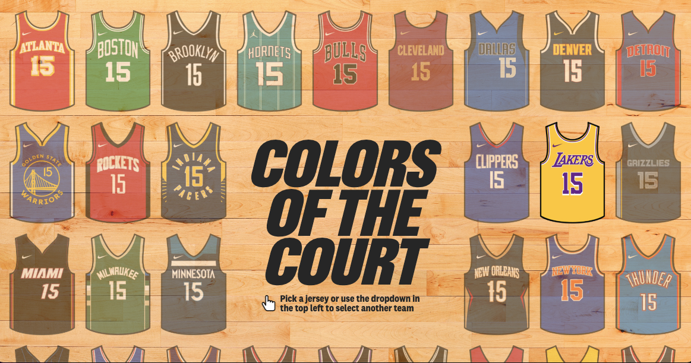
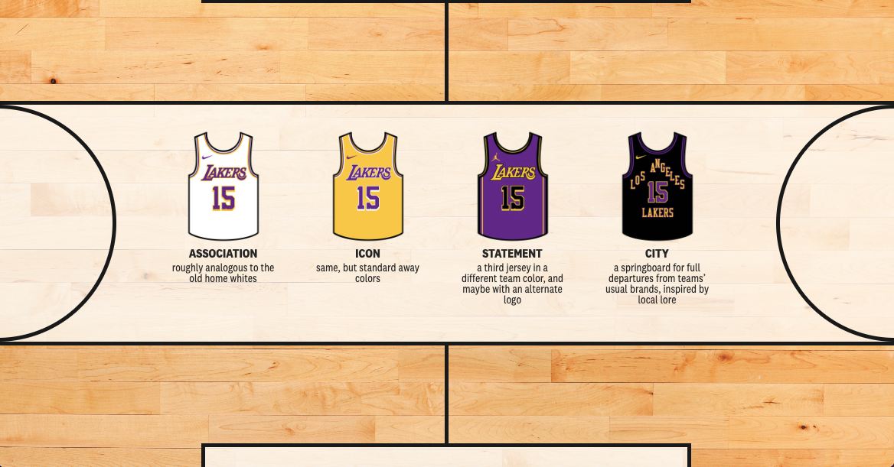
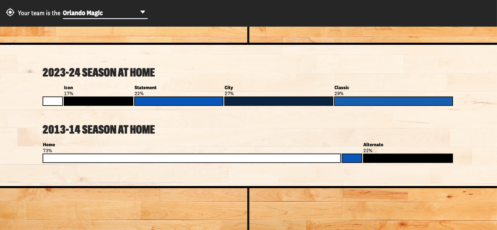
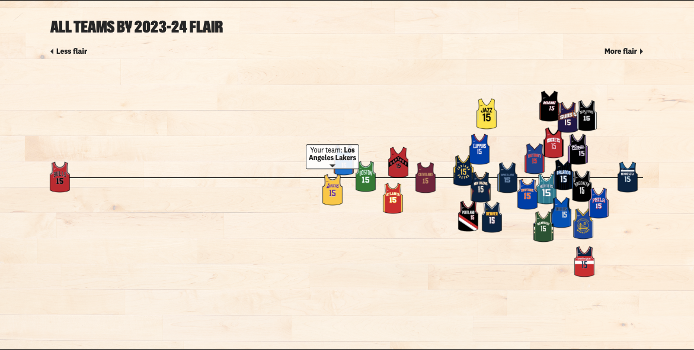
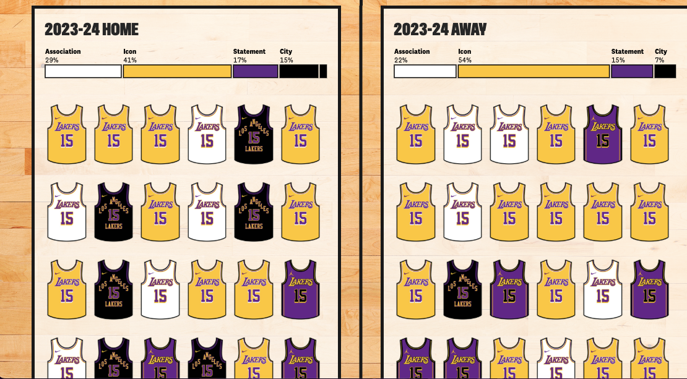

# Tarea 1 Narración Gráfica
## [Webstorie: Colors of the court](https://pudding.cool/2024/10/nba-uniforms/)
Ignacio S. Ruiz 
### Historia que cuenta 
 Esta webstorie, escrita por Tyler Machado e ilustrada por Abram Baclagon, expone el gran cambio que ha tenido la National Basketabll Asociation (NBA) a la hora de implementar ciertos "códigos" de vestimenta al usar los uniformes durante los partidos y cómo han cambiado en comparación a la década pasada. Esto fue posibe recopilando los datos de los distintos colores con los que vistieron los 30 equipos durante los 82 partidos de la temporada regular, tanto de la pasada temporada 23/24, como de la de hace 10 años antes 13/14.

 

El texto epieza explicando como en la década de los 2000 y a hasta mediados de los 2010, existían parámetros muy claros para identificar que equipo jugaba de local y de visita, únicamente viendo como vestían en el parqué. Donde el color que predomina en el local era un uniforme enteramente blanco, mientras que el visitante usaba alguno de sus colores representativos.

Esto hasta que Nike se convirtió en el proveedor oficial de equipaciones de la liga en 2017. Eliminando de lleno el concepto del local blanco e instaurando 4 equipaciones distintas que podían ser utilizadas de acuerdo al criterio de cada franquicia sin importar si ejercían localía o eran visitantes. 

Machado continua explicando que esta libertad a la hora de poder elegir como vestir durante los partidos ha generado una brecha gigantesca entre como los equipos vestían a comparación de hace 10 años atrás.

Existen escuadras más tradicionales que mantienen un uso parecido de su equipación blanca durante la temporada, como los Chicago Bulls, que durante la pasada campaña ocuparon esta equipación un 68% de la campaña, y los equipos que casi ni la ocupan. Llegando a casos como el de Orlando Magic, equipo el cual vistió de blanco en solo 2 ocasiones, o en un 2,4% de toda a temporada, los cuales hace 10 años superaban el 70% de uso de la equipación blanca. 

Asimismo, el texto plantea una métrica basada en el "falir" o "estilo" de cada equipo. En la cual establece como los equipos han dado un paso más allá de usar simples equipaciones y convertir el salir a la pista en un real *"fashion statment"* al usar una amplia variedad de equipaciones durante el año, aumentando la marketiabilidad de la liga y empoderando a los aficionados a ser más libres en la forma en la que deciden representar a su equipo. 

### Explica por qué te pareció interesante y qué aspectos destacarías de su estructura narrativa.

A nivel personal, me encantó la temática a analizar. Es algo super trivial, que en realidad no tiene nada que ver con el juego en si, pero es algo que siempre está presente cada vez que vemos un partido de baloncesto. 

Además la forma de contar los hechos te va nutriendo constantemente de información y contexto que te permite apreciar la "importancia" de que se cambie tan drásticamente esta forma de vestir en las pistas de la NBA. Teniendo el com o vistieron todos los equipos durante cada partido de toda la temporada regular. 

El autor siempre te tiene enganchado, ya sea con las gráficas, los precisos datos y lo shockeante que resluta la información cuando te detienes a mirarla. 

### Evaluación de la efectividad para transmitir información.

Esto es lejos lo más fuerte que tiene esta webstorie. El artículo está hecho de tal forma que puedes ver estas estadísticas de CADA EQUIPO, con pequeños detalle extra para cada franquicia que incentiva la relectura una y otra vez, sientose como si fueran 30 artículos distintos. 

La información se entiende perfectamente en todo momento, como lector, te queda clarísimo como es que ha cambiado tanto este aspecto del baloncesto en tan solo 10 años y te hace cuestionar como serán las estéticas de este deporte en 10 años más. 

------
